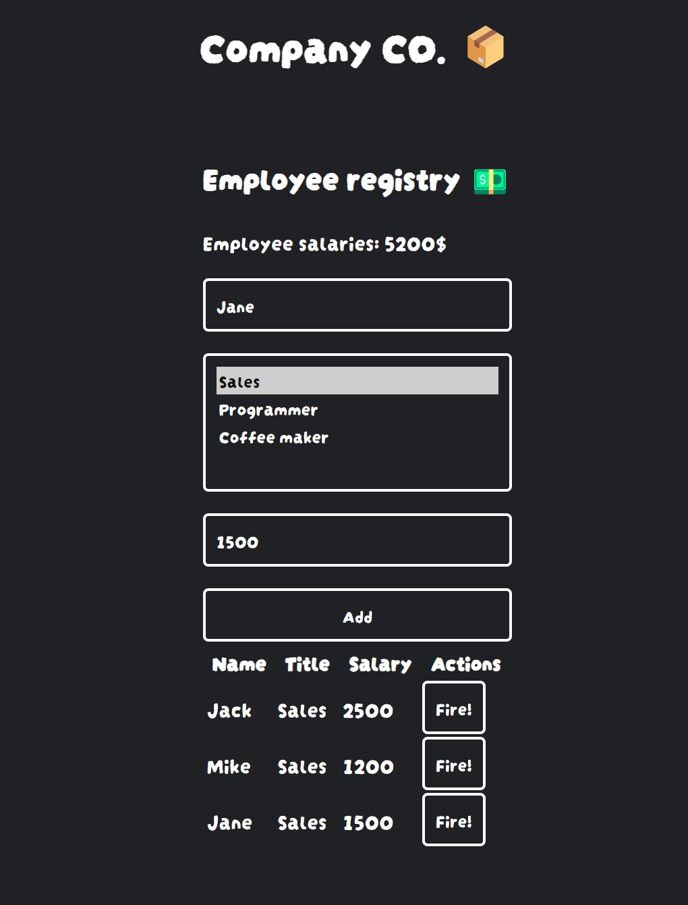

# 

With this little project, I tried to come up with some idea to describe
reactive UI components on my own.

## Result

The main "syntax" for describing the html elements is kinda cool...

With JSX you would do something like this:

```jsx
<div>
    <div className="look-cool">
        <p>Hello there!</p>

        <CustomComponent prop1="Hello" className="look-cool-too" />
    </div>
</div>
```

The same with this "function approach":

```ts
div()(
    div(attribute("class", "look-cool"))(
        p()("Hello there!")

        CustomComponent({prop1: "Hello"}, attribute("class", "look-cool-too"))
    )
)
```

You can see that elements that can have children, return a function that has
to be called in order to get the html element. This second function takes in the
children elements.

## How to create a reusable component?

When creating component with this thing, you first define is it
**typed**, or **typeless**, meaning does it have props or not. Second thing is
to choose wether the component is **parent**, or **leaf**, meaning does it have
children or not.

In the example below there's a component that returns a "dumb component"
representing a human data..

```ts
interface Props {
    name: string
    age: number
}

export default typed.leaf<Props>(({ name, age }) =>
    div()(
        p()(
            b()("Name:"),
            name
        ),
        p()(
            b()("Age:"),
            age
        )
    )
)
```

When you create a component with the functions found inside **typed** or
**typeless** objects, you can access them in almost the same way as you would
with those "element functions". The one above is typed leaf, so you would need
to give props to it but it doesn't have children so it won't return the function
that takes in children.

So the way you would call it is...
```ts
import human from "./path/to/human"

human({ name: "Foo", age: 25 })
```

If it was **typed.parent** then you could call it like...
```ts
human({ name: "Foo", age: 25 })(
    someTypelessLeafComponent()
)
```

## Reactivity stuff

Can you do reactive stuff with it?

Nothing fancy but yes.

You can do it by using the observable function that returns some generic data
wrapped with few functions.

With these functions you can bind observer functions to the data that are then
called when ever the data changes.

There are basic **get**, **set**, and **update**

```ts
export default typeless.leaf(() => {
	const count = observable<number>(0)

	const increment = () => count.update(count => count + 1)
	const decrement = () => count.update(count => count - 1)
	const reset = () => count.set(0)

	const counter = p()()

	count.observe(() => {
		counter.textContent = "Count: " + count.get()
	})

	return div(attribute("class", "counter"))(
		counter,
		div(attribute("class", "button-row"))(
			button(event("click", increment))("Increment"),
			button(event("click", reset))("Reset"),
			button(event("click", decrement))("Decrement")
		)
	)
})
```

As you can see in the above example, the reactivity is very barebones and hardly
abstracts reactivity stuff from the components. This way atleast you know
precisely what happens when the data changes. You can also see that the
components and element functions returns just a plain HTML element. No fancy
virtual dom stuff used.

## Is it anything to write home about?

It was a fun to write and try different little things like counter and todo app
for example, but I wouldn't use it in serious environments.

I would count it as a esoteric ui library.

Atleast it's blazingly fast 🚀🚀🚀 (maybe)


## The Example project

This contains a small example project that shows what's possible.

If you want to check the source out its in the example-app directory!


